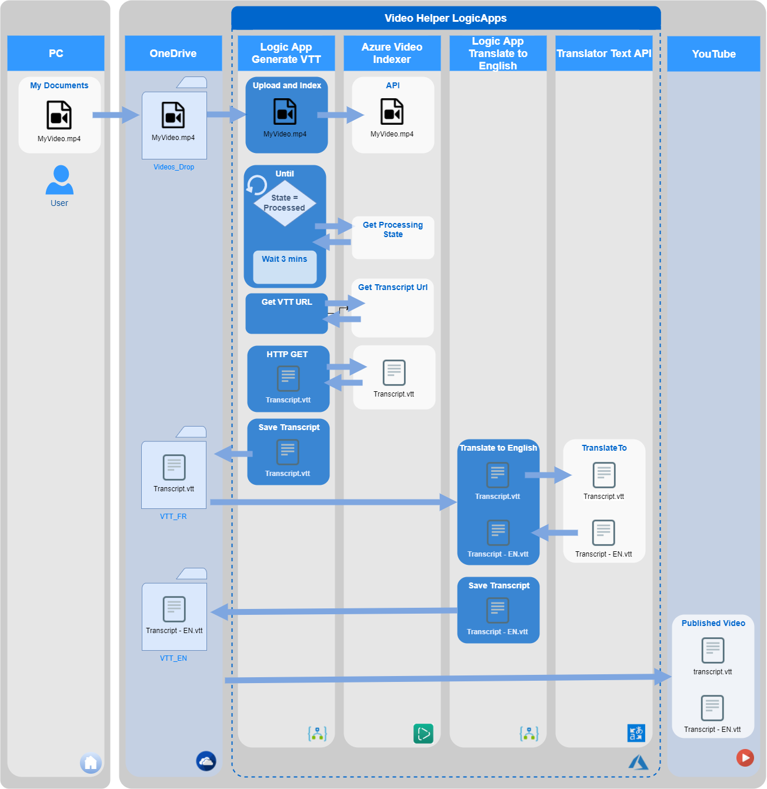

# Cloud5 Video Helper

This solution is to automatically generate video sub-title in another language

## How it works

Once a video is dropped in an OneDrive folder (or any file system accessible from Azure), a Logic App will get triggered and uploads the file to the Azure Video Indexer, generate a Video Text Tracks (VTT) file, and save this new file in another folder. A second Logic App will get started and use the Translator Text API from Azure Cognitive Service to translate the VTT file, and save it into the final folder.

## More

- Blog post (English): http://www.frankysnotes.com/2018/01/how-to-automatically-generate-video-sub.html
- YouTube Video (French): https://www.youtube.com/watch?v=MyZoas3QYgQ
